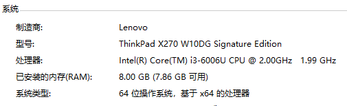
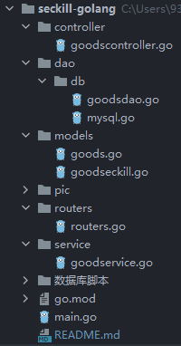

# 简易秒杀系统-Go语言实现


几天速成golang，正好把之前写过的Java版的简易秒杀系统用golang重写一遍，练练手。说是秒杀系统，准确来说是对存在的超卖问题，应用各种锁机制来尝试处理，正好学习一下各种锁的使用。

毕竟还没在生产环境中写过golang，如果有写的不规范或有bug的地方，还望指出，共同进步！


Java版简易秒杀系统GitHub地址：[初探并发编程：秒杀系统](https://github.com/Nobodiesljh/explore-seckill)

个人网站：[轨迹](http://www.trajectories.cn/)

博客：[CSDN](https://blog.csdn.net/Lujiahao98689)


## 一、最原始网页

### 1. 开发环境

- GoLand
- Golang1.16.3
- Go Module
- Gin
- sqlx
- MySQL5.6+
- Redis 5.0.3


### 2. 部署环境

1）除MySQL、Redis外，所有的网页、中间件等都部署在本地win10电脑，配置如下



2）MySQL5.7 和 Redis 5.0.3 部署在了本地的centos7虚拟机上


### 3. 创建数据库/创建项目工程

- 导入数据库脚本，建立好数据库
- 数据库脚本见数据库脚本文件夹中
- 创建工程，配置好环境


### 4. 搭建初始商品购买网页

原本静态的商品购买页面，用从数据库中读取各个商品的数据进行填充，实现不同商品信息的动态查询展示。此时的项目结构如下图



访问网址例如：http://localhost:8080/good?gid=739

- gid=商品编号


## 二、商品信息静态数据优化

在访问商品信息页面的时候，存在很多静态的、不怎么改动的静态资源信息需要从数据库中读取出来，这部分可以利用缓存等技术进行优化，减少对数据库的访问，提高访问性能

静态数据的缓存可以选择Redis来实现。

对于访问静态页面数据的优化方法还有很多，比如页面的静态化处理、动静分离等，这里就不赘述了


## 三、(单机)秒杀系统

### 0. 遇到的问题

1）Error 1040: Too many connections

这是把秒杀用户设置成比较大的数的时候，mysql报的一个错误。这错误好像是当数据库的连接数量陡增的时候就会报出来的一个错误。之前用java实现的秒杀系统中都还没有遇到过这个错误。因为我这里都是创建多个线程来模拟多用户秒杀，所以可见go语言创建线程的轻量级以及速度快。

### 1. case1:不加锁,出现超卖现象
接口：/seckill/handle?gid=1197

接口内模拟了skillNum个用户进行秒杀，观察控制台日志输出的信息。

可以从t_success_killed表中秒杀订单数量 与 t_promotion_seckill表中商品的剩余数量可以看出，出现了超卖


------- 以下内容还未更新--------

### 2. case2:加ReentrantLock,秒杀正常
接口：/seckill/handleWithLock?gid=1197

这里在ReentrantLock和synchronized中选择ReentrantLock，主要是因为synchronized是非公平锁，而ReentrantLock能选择公平与非公平。这里秒杀是要先到先得，因此设置为公平锁

这里注意要用锁把整个事务都包裹起来，不然会因为事务还没提交就把锁资源释放而出现的超卖现象

小柒2012/spring-boot-seckill项目中保留了出现超卖现象的代码块，并且提供一种利用自定义注解来解决bug的方法，见下面的case

### 3. case3:自定义注解+AOP,正常

[从构建分布式秒杀系统聊聊Lock锁使用中的坑](https://blog.52itstyle.vip/archives/2952/)

 接口：/seckill/handleWithAop?gid=1197

 自定义@ServiceLock注解，并自定义LockAspect切面，切给注解，实现一个加锁的操作

### 4. case4:数据库悲观锁(查询加锁),正常
 接口：/seckill/handleWithPccOne?gid=1197

 这里对查询语句添加for update关键字来加排他锁，实现数据库悲观锁

 ```mysql
select ps_count from t_promotion_seckill where goods_id = #{goodsId} for update;
 ```
当一个请求A开启事务并执行此sql同时未提交事务时，另一个线程B发起请求，此时B将阻塞在加了锁的查询语句上，直到A请求的事务提交或者回滚，B才会继续执行，保证了访问的隔离性。

### 5. case5:数据库悲观锁(更新加锁),正常
接口：/seckill/handleWithPccTwo?gid=1197

这里应用mysql数据库本身的特性，即对于UPDATE、DELETE、INSERT语句，InnoDB会自动将涉及的数据集添加排他锁(X锁)。将update商品数量的sql语句上移，并用update操作后返回的结果来判断是否更新成功，来实现数据库悲观锁

### 6. case6:数据库乐观锁，正常
接口：/seckill/handleWithOcc?gid=1197

利用数据库乐观锁，给秒杀商品信息添加了一个version版本号的字段，来进行版本号的更新。一些用户会因为乐观锁的原因，而被告知下单失败，需要用户再重复操作。

如果秒杀用户比较少的时候，可能会出现少买现象，就是还会剩余一些商品没有被成功卖出去。

### 7. case7:JDK内置阻塞队列，正常

接口：/seckill/handleWithBlockingQueue?gid=1197

BlockingQueue阻塞队列会被频繁的创建和消费，所以需要将其设置成全局使用，并保证一个类只有一个实例，哪怕是多线程同时访问，还需要提供一个全局访问此实例的点。因此，这里使用到了**单例模式**实现

这里SecKillQueue的单例模式是使用类的静态内部类的写法实现的，既保证了线程安全也保证了懒加载，同时也没有加锁的耗费性能的情况。主要是依靠JVM虚拟机可以保证多线程并发访问的正确性，也就是一个类的构造方法在多线程环境下可以被正确的加载

生产：利用JDK自带的线程安全的阻塞队列LinkedBlockingQueue实现，将秒杀信息添加到阻塞队列中，等待被消费

消费：编写一个实现了ApplicationRunner的启动加载类：BlockingQueueConsumer。项目启动完成后，当有秒杀信息传入阻塞队列时，取出信息消费，进行秒杀处理。这里使用串行消费，所以直接调用没有加锁的方法就可以

注：小柒2012/spring-boot-seckill项目中另外提供了一种利用高性能队列Disruptor实现的接口。实现的原理差不多，这里就不赘述了

## 四、分布式秒杀系统 feature/seckillDistribute分支

### 0. 准备

1）搭建三主三从Cluster模式的Redis集群,配置Redisson

2）搭建zookeeper集群,导入Curator依赖


### 1. case1:基于Redisson的Redis分布式锁，正常

接口：/seckillDistributed/handleWithRedisson?gid=1197

注意要用Redis Lock把整个事务提交都包住。这里仅仅使用了Redis分布式提供的锁功能，秒杀数据处理还是直接访问数据库来完成

### 2. case2:基于Curator的Zookeeper分布式锁，正常

接口：/seckillDistributed/handleWithZk?gid=1197

类似于之前使用BlockingQueue时编写了一个单例模式的工具类来全局使用的形式相同，这里也采用静态内部类形式的单例模式编写一个Curator框架的分布式锁功能工具类ZkLockUtil来实现全局调用

注意这里也要用Zookeeper分布式锁把整个事务提交都包住。这里只用了zookeeper的分布式锁功能，秒杀数据处理也是直接访问数据库来完成

### 3. case3:Redis的List队列，正常

接口：/seckillDistributed/handleWithRedisList?gid=1197

这里利用Redis队列的方法，与 小柒2012/spring-boot-seckill 中的略有不同，在小柒2012/spring-boot-seckill项目中，是将在前端进行秒杀的用户的信息传入到通道中，等待被消费。后端订阅监听这个通道，有秒杀用户信息传过来就进行消费处理，再将处理数据写入到数据库。

这里利用Redis分布式队列的方式是，在秒杀活动初始化阶段时有多少库存就在Redis的List中初始化多少个商品元素。然后每有一个用户进行秒杀，就从List队列中取出一个商品元素分配给该用户。同时将该用户信息存入到Redis的Set类型中，防止用户多次秒杀的情况。在秒杀结束之后，在Redis中数据写入到数据库中进行保存。可参考下图：


### 4. case4:Redis原子递减,正常

接口：/seckillDistributed/handleWithRedisIncr?gid=1197

这里先将秒杀商品的库存数量，写入到redis中，利用redis的incr来实现原子递减。假如有100件商品，这里相当于准备好了100个钥匙，有人没有抢到钥匙，就返回库存不够，有人抢到了钥匙，就进行下一步处理，先将秒杀订单的信息写入到redis中，等空闲下来后在写入到数据库中。这里其实与case3差不多

### 5. 其他
以下几种方法这里就不赘述了

1）基于Redis的任务队列，订阅监听

2）基于MQ消息队列的分布式锁

## 五、秒杀系统性能提升

本项目主要为学习并发编程及各种锁应用的知识，因此对于秒杀系统进一步的性能提升的操作就不再赘述了，祁老师秒杀实战中进一步的视频教程，感兴趣的可以深入了解

主要还存在的提升点：

- 利用MQ进行流量削峰
- Nginx负载均衡
- 读写分离与分表分库
- CDN内容分发网络
- 流量防刷和反爬虫
- 等等

## 六、bugfix

### 1. Spring AOP自调用问题
- 若同一个类中的其他没有``@Transactional``注解的方法内部调用有``@Transactional``注解的方法，有``@Transactional``注解的方法的事务会失效
- 这里直接在外部的方法上添加了``@Transactional``注解。利用了Spring事务传播行为的特性